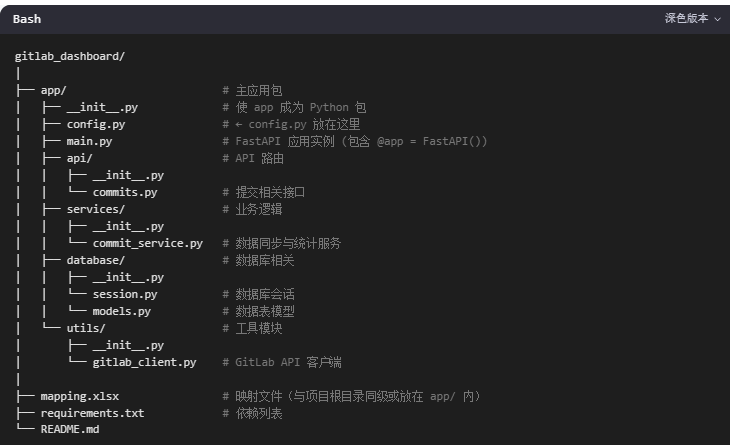

# 代码提交统计系统需求文档

---

## 1. 概述

本项目旨在构建一个本地运行的前后端分离应用，用于统计开发人员在 `****` 上的代码提交情况。后端负责从 GitLab 获取、筛选、处理并存储提交数据，前端提供可视化界面展示统计结果。

---

## 2. 后端需求

### 2.1 数据获取
- 程序每次运行时，自动查询 **昨天** 的所有 commit 记录。
- 可通过 GitLab API 或本地仓库日志方式获取数据。

### 2.2 数据筛选
仅当 commit **同时满足以下所有条件**时，才写入数据库：
- **非 CICD 提交**：排除由 CI/CD 系统自动触发的提交（可通过作者名、邮箱或提交信息识别）。
- **additions ≤ 2000**：新增代码行数不超过 2000。
- **parents_id ≤ 1**：提交的父提交数量不超过 1（即非合并提交）。

### 2.3 数据处理与映射
- 提取字段：`project_id`, `branch`, `author`, `date`, `additions`, `deletions`, `com_email`, `author_email`, `commit_id`
- 使用 `mapping.xlsx` 文件进行作者名称标准化：
  - 初始化：`email = commit.author_name`, `author_name = commit.author_name`
  - 查找 `mapping.xlsx` 中 `email` 列是否匹配：
    - 若匹配，将 `author_name` 替换为对应的 `name` 值
    - 若不匹配，保留原始 `author_name`

### 2.4 数据存储
- 将处理后的数据写入数据库。
- **数据库表字段**：
  - `commit_id` (VARCHAR)
  - `project_id` (INTEGER)
  - `branch`（VARCHAR）
  - `author_name` (VARCHAR) — 标准化后的作者名'
  - `author_email` (VARCHAR) — 作者邮箱
  - `com_email` (VARCHAR) — 提交者邮箱
  - `commit_date` (DATE)
  - `additions` (INTEGER)
  - `deletions` (INTEGER)
  - `parents_ids`（VARCHAR）
- **主键**：`(commit_id)`

### 2.5 API 接口
- 提供 RESTful API，支持以下查询：
  - 按时间范围查询（支持：最近 1/7/14/30/60 天、半年）
  - 自定义起止日期查询
- **默认行为**：返回最近 7 天的数据
- **返回格式**：JSON
- **返回内容**：按 `author` 聚合，包含每个作者的：
  - `author`（作者名）
  - `total_additions`（总新增行数）
  - `total_deletions`（总删除行数）

### 2.6 后端结构

---

## 3. 前端需求

### 3.1 页面功能
- 展示开发人员代码提交统计数据。
- 提供日期选择控件，支持两种模式：
  - **快捷选择**：按钮形式提供：最近 1 天、7 天、14 天、30 天、60 天、半年
  - **自定义选择**：日历控件允许用户选择起止日期
- **默认展示**：页面加载时，自动显示最近 7 天的统计数据

### 3.2 数据展示
- 以表格形式展示每位开发者的提交统计。
- 聚合规则：
  - 相同 `author` 的数据合并为一条记录
  - 计算总 `additions` 和总 `deletions`
- 可选展示字段：提交次数、净增行数（additions - deletions）、平均每次提交行数等

### 3.3 技术要求
- 前后端通过 API 通信
- 使用 Python 生态技术栈（FastAPI + Jinjia2）
- 界面简洁、响应式，用户体验良好

---

## 4. 依赖与配置

- **配置文件**：
  - `gitlab_url`: `http://gitlab.irootech.com`
  - `mapping_file`: `mapping.xlsx`（路径）
- **mapping.xlsx 文件结构**：
  | email (STRING) | name (STRING) |
  |----------------|---------------|
  | dev1@irootech.com | 张三         |
  | dev2@irootech.com | 李四         |

---

## 5. 运行流程

1. 后端程序运行
2. 查询昨天的 commit 记录
3. 筛选并处理数据（含作者映射）
4. 写入数据库（去重）
5. 启动 API 服务
6. 前端访问页面，调用 API 获取数据并展示

---

**版本**：1.0  
**最后更新**：2025年8月22日